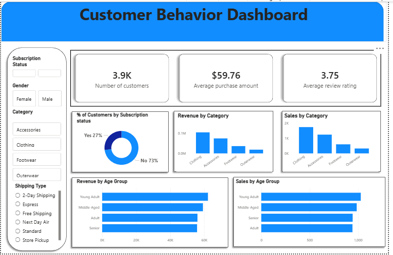

<h1 align="center">📊 Customer Behavior Analysis</h1>

<p align="center">
  End-to-end Data Analytics Project using Python, SQL, and Power BI
</p>

<p align="center">
  
  
  
</p>

---

## 🔍 Project Overview
This project analyzes customer shopping behavior using transactional data to uncover insights into:
- 📈 Spending patterns  
- 👥 Customer segmentation  
- 🛍️ Product preferences  

The goal is to support **data-driven business decisions** through analytics and visualization.

---

## 📊 Dashboard Preview

<p align="center">
  
  <br>
  <em>Interactive Power BI dashboard showcasing customer insights</em>
</p>

---

## 🛠️ Tech Stack

| Tool | Purpose |
|------|--------|
| 🐍 Python (Pandas, NumPy) | Data cleaning & preprocessing |
| 🗄️ SQL (PostgreSQL / MySQL / SQL Server) | Data analysis |
| 📊 Power BI | Dashboard & visualization |

---

## ⚙️ Project Workflow

### 🧹 1. Data Cleaning (Python)
- Loaded dataset using Pandas  
- Handled missing values  
- Standardized column names  
- Created features:
  - Age groups  
  - Purchase frequency  
- Removed redundant columns  

---

### 📊 2. Data Analysis (SQL)
- Revenue analysis by gender  
- High-spending customers using discounts  
- Top-rated & best-selling products  
- Shipping type comparison  
- Subscriber vs non-subscriber behavior  
- Customer segmentation (New, Returning, Loyal)  
- Revenue by age group  

---

### 📈 3. Data Visualization (Power BI)
- Built interactive dashboard  
- Analyzed:
  - Revenue trends  
  - Customer segments  
  - Product performance  

---

## 📌 Key Insights
✔ High-value customer segments identified  
✔ Top-performing products discovered  
✔ Discounts impact revenue significantly  
✔ Subscribers show different spending behavior  

---

## 💡 Business Recommendations
- 🎯 Promote subscription programs  
- 🎁 Introduce loyalty rewards  
- 📉 Optimize discount strategies  
- 📢 Target high-revenue segments  

---

## 📁 Project Structure
```bash
data/            # Raw & cleaned datasets  
notebooks/       # Python scripts  
sql/             # SQL queries  
dashboard/       # Power BI file  
README.md  
